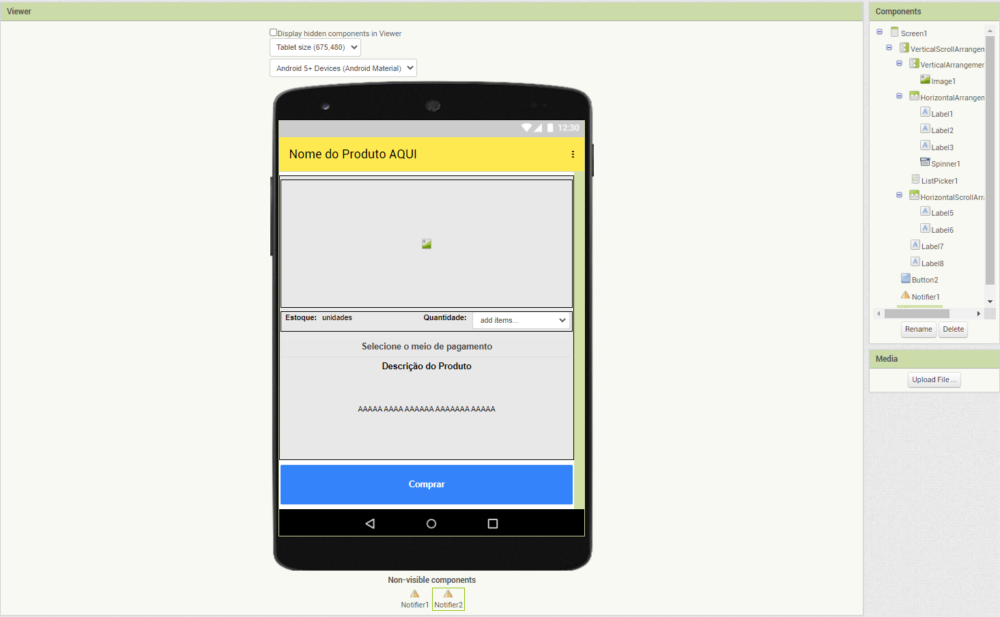

# Template para a Entrega do Projeto Final

# Estrutura de Arquivos e Pastas

A seguir é apresentada a estrutura de pastas esperada para entrega do projeto:

~~~
├── README.md  <- arquivo com o relatório do projeto
│
├── images     <- arquivos de imagens usadas no documento
│
└── resources  <- outros recursos (se houver)
~~~

Na raiz deve haver um arquivo de nome `README.md` contendo a apresentação da equipe e relatório do projeto, como detalhado na seção seguinte.

# Modelo para Apresentação da Equipe e Relatório do Projeto

Segue abaixo o modelo de como devem ser documentadas as entregas. Tudo o que for indicado entre `<...>` indica algo que deve ser substituído pelo indicado.
> Além disso, tudo o que aparecer neste modo de citação também se refere algo que deve ser substituído pelo indicado. No modelo são colocados exemplos ilustrativos, que serão substituídos pelos da sua apresentação.

Para a construção dos diagramas, devem ser usados modelos disponíveis em: [Diagramas de Referência do Projeto Final](https://docs.google.com/presentation/d/1HWiTx0HU781sf3A7sdAda_LQeMHqbvIXkh-uSRDo0Js/edit?usp=sharing). Há versões em PPT e ODT no diretório [resources/](resources/).

# Modelo para Apresentação da Equipe e Relatório do Projeto

# Projeto `CRS - Marketplace`

# Equipe
* `Amanda Souza Macedo Bacelli`
* `Matheus Raposo Frauches Vieira Sias`

# Nível 1

> Apresente aqui o detalhamento do Nível 1 conforme detalhado na especificação com, no mínimo, as seguintes subseções:

## Diagrama Geral do Nível 1

### Detalhamento da interação de componentes

* O componente `Distribuição de Ofertas` interage nos processos abaixo:
  * **SendAlert**: Interface que recebe a interface fornecida _Subscribe_ do componente `Cliente` que indica que o cliente quer assinar uma oferta de um determinado produto e assim é feita a distribuição das ofertas conforme essa assinatura
  * **ReceiveChoose**: Interface que recebe a interface _SendChooseCliente_ do componente `Solicita Produto`, quando o cliente escolhe um produto para compra, o componente envia para o componente de Distribuição de Ofertas para que assim ele saiba as escolhas do cliente e prepare ofertas similirares ao produto escolhido
  * **ReceiveOffer**: tópico que recebe o aviso de quando uma `Loja` cria uma oferta faz a leitura de _CreateOffer_ `product/+/alert`
  * **AnalyseSearches**: tópico que analisa as buscas realizadas pelo cliente para que possa gerar ofertas similares, faz a leitura de _FindProducts_`product/+/find`
  * **OrderAnalyser**: Analisa as ordens emitidas pelas `Lojas` através do tópico _Order_ `order/+/send`e assim aprimorar o aprendizado do componente

* O componente `Cliente` interage nos processos abaixo:
  * **Subscribe**: Se inscreve em uma determinada oferta através da interface _SendAlert_ do componente `Distribuição de Ofertas`
  * **PaymentOrder**: Recebe os dados para o pagamento para a interface _RequestPayment_ do componente `Pagamento`
  * **ReceiverOrder**: Recebe a ordem da interface _SendOrder_ do componente `Solicita produto`
  * **ChooseProductAndStore**: Fornece o produto e a loja escolhida para a compra para a interface _ReceiverProductAndStore_ do componente `Solicita Produto`
  * **FindProducts**: Envia mensagem ao buscar um produto através do barramento através da mensagem _ShowProducts_ 
  * **FollowOrder**: Tópico para receber status de ordens emitidas através do tópico _Order_ `order/{orderId}/send`

* O componente `Solicita Produto` interage nos processos abaixo:
  * **SendOrder**: Envia a order para a interface _ReceiveOrder_ do componente `Cliente` com a Ordem recebida via tópico _SendOrder_ `order/+/send`
  * **ReceiveProductAndStore**: Interface que recebe o produto e a loja escolhida pelo cliente
  * **SendChooseClient**: envia a escolha do cliente para o componente `Distribuição de ofertas`
  * **RequestBuy**: envia um tópico para a loja referente ao produto a ser comprado para a loja
  
* O componente `Loja` interage nos processos abaixo:
  * **SendOrder**: Envia a ordem com o produto para que o cliente possa acompanhar através do tópico _FollowOrder_ `order/{orderId}/send`
  * **ReceivePayment**: recebe o pagamento através do tópico _SendPayment_ `order/+/payment/+/accept`do componente `Pagamento` 
  * **CreateOffer**: Cria as ofertas de seus produtos
  * **ShowProduct**: Exibe o produto quando recebe o tópico de busca através do barramento
  * **Order**: envia a order quando a compra é solicitada através do _RequestBuy_ `product/+/store/+/buy`

* O componente `Pagamento` interage nos processos abaixo:
  * **RequestPayment**: solicita o pagamento para a interface do componente `Cliente`
  * **SendPayment**: envia a mensagem do pagamento da ordem através do barramento

> Para cada componente será apresentado um documento conforme o modelo a seguir:

## Componente `Distribuição de Ofertas`
> Componente responsável pela distribuição de ofertas, sendo de origem de assinatura (por desejo do cliente) ou atraves do aprendizado da máquina

## Componente `Cliente`

> Componente responsável por orquestrar todos os fluxos do marketplace, sendo na busca, compra, pagmento e recebimento de oferta

## Componente `Pagamento`

> Componente responsável emitir e controlar pagamento da ordem

## Componente `Loja`

> Componente responsável emitir ordem, ofertas e exibir seus produtos mediante uma solicitação de busca

**Interfaces**
> Listagem das interfaces do componente.

As interfaces listadas são detalhadas a seguir:

## Detalhamento das Interfaces

### Interface `FindProducts`

> Envia a busca dos produtos feita pelo cliente

* Type: source
* Topic: product/+/find
* Message type: Product

~~~json
{
  productId: number,
  description: string,
  price: double,
  stores: [
    {
      storeid: number,
      description: string
    }
  ]
}
~~~

### Interface `ShowProduct`

> Exibe os produtos buscados de cada Loja

* Type: sink
* Topic: product/{productId}/find
* Message type: Product

~~~json
{
  productId: number,
  description: string,
  price: double,
  stores: [
    {
      storeid: number,
      description: string
    }
  ]
}
~~~

### Interface `AnalyzerSeaches`

> Analisa as buscas feitas pelo cliente para aprendizagem do componente Distribuição de Ofertas

* Type: sink
* Topic: product/{productId}/find
* Message type: Product

~~~json
{
  productId: number,
  description: string,
  price: double,
  stores: [
    {
      storeid: number,
      description: string
    }
  ]
}
~~~

### Interface `ReceiveOffer`

> Recebe as ofertas emitidas pela Loja

* Type: sink
* Topic: product/{productId}/alert
* Message type: Product

~~~json
{
  productId: number,
  description: string,
  price: double,
  stores: [
    {
      storeid: number,
      description: string
    }
  ]
}
~~~

### Interface `CreateOffer`

> Envia a oferta de um determinado produto

* Type: source
* Topic: product/+/alert
* Message type: Product

~~~json
{
  productId: number,
  description: string,
  price: double,
  stores: [
    {
      storeid: number,
      description: string
    }
  ]
}
~~~

### Interface `RequestBuy`

> Envia a requisição de compra de um produto para uma loja

* Type: source
* Topic: product/+/store/+/buy
* Message type: Order

~~~json
{
  orderId: string,
  date: date,
  total: number,
  statusOrdem: string
  storeId: number,
  products: [
    {
      productId: number,
      quantity: number
    }
  ],
  payment:
  {
    date: date,
    value: number,
    Status: string
  }
}
~~~

### Interface `Order`

> Cria a ordem do produto

* Type: sink
* Topic:product/{productId}/store/{storeId}/buy
* Message type: Order

~~~json
{
  orderId: string,
  date: date,
  total: number,
  statusOrdem: string
  storeId: number
  products: [
    {
      productId: number,
      quantity: number
    }
  ]
  payment:
  {
    date: date,
    value: number,
    Status: string
  }
}
~~~

### Interface `FollowOrder`

> Acompanha o envio da ordem e seu status

* Type: sink
* Topic: order/{orderId}/send
* Message type: Order

~~~json
{
  orderId: string,
  date: date,
  total: number,
  statusOrdem: string
  storeId: number
  products: [
    {
      productId: number,
      quantity: number
    }
  ]
  payment:
  {
    date: date,
    value: number,
    Status: string
  }
}
~~~

### Interface `SendOrder`

> Envia a ordem ao barramento para que o cliente consiga acompanhar

* Type: source
* Topic: order/+/send
* Message type: Order

~~~json
{
  orderId: string,
  date: date,
  total: number,
  storeId: number,
  statusOrdem: string
  products: [
    {
      productId: number,
      quantity: number
    }
  ]
  payment: {
    date: date,
    value: number,
    Status: string
  }
}
~~~

### Interface `SendPayment`

> Envia o status do pagamento da ordem e os dados do pagamento

* Type: source
* Topic: order/+/payment/+/accept
* Message type: Payment

~~~json
{
  paymentId: string,
  date: date,
  value: double,
  status: string,
  order:
  {
    orderId: string
  }
}
~~~

### Interface `ReceivePayment`

> Recebe os dados do pagamento da ordem em questão

* Type: sink
* Topic:order/{orderId}/payment/{paymentId}/accept
* Message type: Payment

~~~json
{
  paymentId: string,
  date: date,
  value: double,
  status: string,
  order:
  {
    orderId: string
  }
}
~~~

# Nível 2

> Apresente aqui o detalhamento do Nível 2 conforme detalhado na especificação com, no mínimo, as seguintes subseções:

## Diagrama do Nível 2

> Apresente um diagrama conforme o modelo a seguir:

> 

### Detalhamento da interação de componentes

> O detalhamento deve seguir um formato de acordo com o exemplo a seguir:

* O componente `Entrega Pedido Compra` assina no barramento mensagens de tópico "`pedido/+/entrega`" através da interface `Solicita Entrega`.
  * Ao receber uma mensagem de tópico "`pedido/+/entrega`", dispara o início da entrega de um conjunto de produtos.
* Os componentes `Solicita Estoque` e `Solicita Compra` se comunicam com componentes externos pelo barramento:
  * Para consultar o estoque, o componente `Solicita Estoque` publica no barramento uma mensagem de tópico "`produto/<id>/estoque/consulta`" através da interface `Consulta Estoque` e assina mensagens de tópico "`produto/<id>/estoque/status`" através da interface `Posição Estoque` que retorna a disponibilidade do produto.

> Para cada componente será apresentado um documento conforme o modelo a seguir:

## Componente `<Nome do Componente>`

> Resumo do papel do componente e serviços que ele oferece.

**Interfaces**
> Listagem das interfaces do componente.

As interfaces listadas são detalhadas a seguir:

## Detalhamento das Interfaces

### Interface `<nome da interface>`

> Resumo do papel da interface.

Método | Objetivo
-------| --------
`<id do método>` | `<objetivo do método e descrição dos parâmetros>`

## Exemplos:

### Interface `ITableProducer`

Interface provida por qualquer fonte de dados que os forneça na forma de uma tabela.

Método | Objetivo
-------| --------
`requestAttributes` | Retorna um vetor com o nome de todos os atributos (colunas) da tabela.
`requestInstances` | Retorna uma matriz em que cada linha representa uma instância e cada coluna o valor do respectivo atributo (a ordem dos atributos é a mesma daquela fornecida por `requestAttributes`.

### Interface `IDataSetProperties`

Define o recurso (usualmente o caminho para um arquivo em disco) que é a fonte de dados.

Método | Objetivo
-------| --------
`getDataSource` | Retorna o caminho da fonte de dados.
`setDataSource` | Define o caminho da fonte de dados, informado através do parâmetro `dataSource`.

## Diagrama do Nível 3

> Interface de compra de um produto

> Apresente o diagrama referente ao protótipo conforme o modelo a seguir:

### Detalhamento da interação de componentes

> O detalhamento deve seguir o mesmo formato usado no Nível 2.
